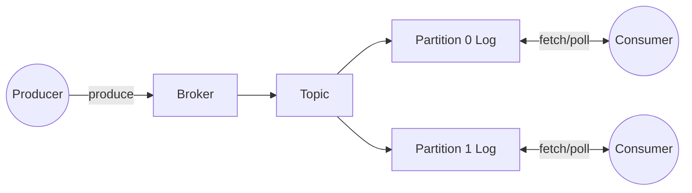

# TinyMQ

Tiny message queue inspired by Kafka, built for learning. It supports topics,
partitions, consumer groups, and a JSON-over-TCP protocol so you can explore
messaging basics without heavy dependencies.

## Simple system diagram



## Features

- Topic creation with configurable partitions
- Produce by explicit partition or key-based hashing with round-robin fallback
- Fetch by offset with simple batch limits
- Consumer group coordination with heartbeats and round-robin assignment
- Commit offsets and compute lag metrics
- Optional file-backed log storage (JSON lines) for replay

## Quick start: JSON over TCP (learning mode)

Run the server:

```bash
dart run bin/tinymq_server.dart
```

Connect with netcat:

```bash
nc 127.0.0.1 4040
```

Requests are one-line JSON objects. Responses are JSON with `ok` and `data` or `error`.

Create topic:

```json
{"type":"createTopic","topic":"events","partitions":2}
```

Produce:

```json
{"type":"produce","topic":"events","value":"hello","key":"k1"}
```

Fetch:

```json
{"type":"fetch","topic":"events","partition":0,"offset":0,"max":10}
```

Commit:

```json
{"type":"commit","groupId":"g1","topic":"events","partition":0,"offset":1}
```

Metrics:

```json
{"type":"metrics","topic":"events","partition":0,"groupId":"g1"}
```

Heartbeat (keep membership alive):

```json
{"type":"heartbeat","groupId":"g1","consumerId":"consumer-1"}
```

Join group (get partition assignment):

```json
{"type":"joinGroup","groupId":"g1","topic":"events","consumerId":"consumer-1"}
```

Leave group:

```json
{"type":"leaveGroup","groupId":"g1","consumerId":"consumer-1"}
```

List topics:

```json
{"type":"listTopics"}
```

Sample session (copy/paste line by line into `nc`):

```json
{"type":"createTopic","topic":"events","partitions":2}
{"type":"produce","topic":"events","value":"boot"}
{"type":"produce","topic":"events","value":"user:42","key":"user-42"}
{"type":"produce","topic":"events","value":"click","partition":0}
{"type":"fetch","topic":"events","partition":0,"offset":0,"max":10}
{"type":"commit","groupId":"g1","topic":"events","partition":0,"offset":3}
{"type":"metrics","topic":"events","partition":0,"groupId":"g1"}
{"type":"listTopics"}
```

## Consumer process (learning mode)

Run the broker server:

```bash
dart run bin/tinymq_server.dart
```

Run a separate consumer process:

```bash
dart run bin/tinymq_consumer.dart
```

The consumer joins a group and polls its assigned partitions.

Multiple consumers (same group, different consumerId):

```bash
dart run bin/tinymq_consumer.dart events group-a consumer-1
dart run bin/tinymq_consumer.dart events group-a consumer-2
```

Consumers with different groups will each receive all partitions.

Rebalance behavior:
- Consumers periodically re-join the group (heartbeat).
- If a consumer stops, its partitions will be reassigned after a short timeout.

## Protocol overview

All requests are single-line JSON objects. Responses are JSON with `ok` and
either `data` or `error`.

Request types:
- `createTopic`: `topic`, `partitions` (default 1)
- `produce`: `topic`, `value`, optional `key`, optional `partition`
- `fetch`: `topic`, `partition`, `offset`, optional `max` (default 100)
- `commit`: `groupId`, `topic`, `partition`, `offset`
- `metrics`: `topic`, `partition`, optional `groupId`
- `listTopics`: no fields
- `joinGroup`: `groupId`, `topic`, `consumerId`
- `leaveGroup`: `groupId`, `consumerId`
- `heartbeat`: `groupId`, `consumerId`

## Storage and offsets

- Logs are kept in memory and optionally persisted to
  `data/tinymq-demo/<topic>/partition-<id>.log` as JSON lines.
- Committed offsets are stored in memory only (restart resets group progress).
- Offsets are zero-based and increase by one per record.

## Tests

```bash
dart test
```

## License

MIT. See `LICENSE`.
