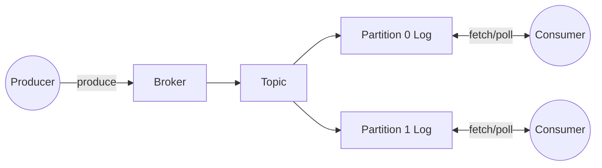

# TinyMQ

Tiny message queue inspired by Kafka.

## Simple system diagram

```mermaid
flowchart LR
  Producer((Producer)) -->|produce| Broker[Broker]
  Broker --> Topic[Topic]
  Topic --> P0[Partition 0 Log]
  Topic --> P1[Partition 1 Log]
  P0 <-->|fetch/poll| Consumer0((Consumer))
  P1 <-->|fetch/poll| Consumer1((Consumer))
```
