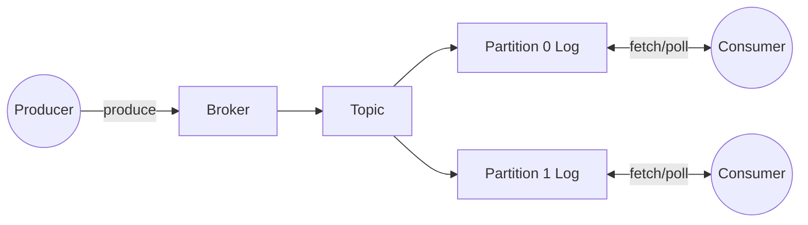

# TinyMQ

Tiny message queue inspired by Kafka.

## Simple system diagram



## JSON over TCP (learning mode)

Run the server:

```bash
dart run bin/tinymq_server.dart
```

Connect with netcat:

```bash
nc 127.0.0.1 4040
```

Requests are one-line JSON objects. Responses are JSON with `ok` and `data` or `error`.

Create topic:

```json
{"type":"createTopic","topic":"events","partitions":2}
```

Produce:

```json
{"type":"produce","topic":"events","value":"hello","key":"k1"}
```

Fetch:

```json
{"type":"fetch","topic":"events","partition":0,"offset":0,"max":10}
```

Commit:

```json
{"type":"commit","groupId":"g1","topic":"events","partition":0,"offset":1}
```

Metrics:

```json
{"type":"metrics","topic":"events","partition":0,"groupId":"g1"}
```

List topics:

```json
{"type":"listTopics"}
```
